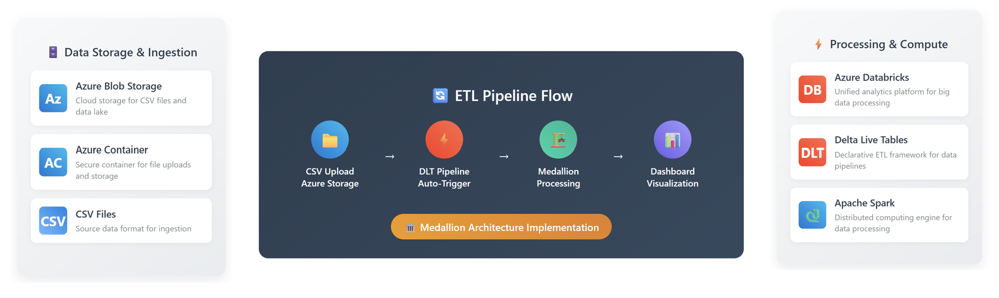

# Diabetes Data Analysis - ETL Pipeline

This project implements a complete diabetes data analysis ETL workflow using Azure Databricks Delta Live Tables (DLT) with a three-layer medallion architecture: Bronze (raw data ingestion), Silver (data cleaning and feature engineering), and Gold (business-ready analytics).

## Tech Stack



## Project Structure

```
diabetes-etl/
├── data/                                    # Sample diabetes datasets (6 CSV files)
│   ├── diabetes_part_1.csv
│   ├── diabetes_part_2.csv
│   ├── diabetes_part_3.csv
│   ├── diabetes_part_4.csv
│   ├── diabetes_part_5.csv
│   └── diabetes_part_6.csv
├── docs/                                    # Project documentation
│   ├── diabetes-etl-documentation.docx     # Detailed setup and architecture guide
│   └── diabetes-etl-ppt.pptx              # Project presentation
├── reports/                                 # Dashboard exports
│   └── Diabetes-Dashboard.lvdash.json      # Databricks dashboard import file
├── src/                                     # Source code
│   └── diabetes_etl_pipeline.py            # Main DLT pipeline implementation
└── README.md                              
```

## Features


## Dataset


## Setup Instructions

### 1. Azure Databricks Environment Setup

📋 **For detailed Azure Databricks setup instructions, please refer to:**

- **[docs/diabetes-etl-documentation.docx](docs/diabetes-etl-documentation.docx)** - Complete setup guide including:
  - Azure Storage Account configuration
  - Databricks workspace setup
  - Service principal authentication
  - Compute cluster configuration
  - Required libraries and dependencies

### 2. Import DLT Pipeline Source Code

1. **Upload Pipeline Code to Databricks:**

   ```bash
   # Navigate to your Databricks workspace
   # Go to Workspace → Users → [your-user] → Import
   ```

2. **Import the main pipeline file:**
   - Upload **[src/diabetes_etl_pipeline.py](src/diabetes_etl_pipeline.py)** to your Databricks workspace
   - Ensure the file is imported as a **Databricks notebook**

3. **Configure Pipeline Settings:**
   - Update storage account and container names in the pipeline configuration
   - Verify schema and catalog names match your environment

### 3. Create Delta Live Tables Pipeline

1. **In Databricks, navigate to:** `Workflows` → `declarative pipelines`

2. **Create a New Pipeline:**
   - Click `Create Pipeline`
   - Name your pipeline (e.g., `Diabetes_ETL_Pipeline`)
   - Select the notebook you imported in Step 2 as the source
   - Configure the target schema and catalog for your DLT tables


### 4. Import Dashboard to Databricks

1. **Navigate to Databricks Dashboards:**
   - Go to `Workspace` → `Dashboards` in your Databricks environment

2. **Import Dashboard Configuration:**
   - Click `Create` → `Import Dashboard`
   - Upload **[reports/Diabetes-Dashboard.lvdash.json](reports/Diabetes-Dashboard.lvdash.json)**
   - Configure data source connections to point to your DLT tables

3. **Update Dashboard Queries:**
   - Modify catalog and schema references in the dashboard queries
   - Update table names to match your DLT pipeline output tables:
     - `diabetes_executive_summary`
     - `diabetes_demographics_summary`  
     - `diabetes_risk_analysis`
